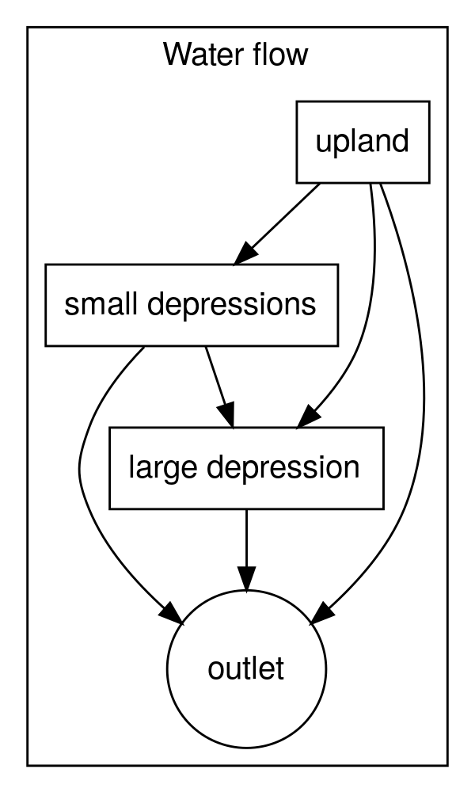

```{r setup, include=FALSE}
knitr::opts_chunk$set(eval = TRUE,
                      echo = TRUE,
                      fig.width = 7, 
                      warning = FALSE,
                      message = FALSE)
library(HGDMr)
library(ggplot2)
```

# Introduction

The Hysteretic and Gatekeeping Depressions Model (HGDM) was developed to
model the time-varying effects of depressional storage on the
connected/contributing fractions of basins in the Canadian Prairies. The
hydrology of this region is dominated by the presence of millions of
depressions ("potholes" or "sloughs") which trap water from
precipitation (rainfall, snowmelt) on the depressions and upland runoff
into the depressions. When depressions fill to their spill point,
additional inputs of water can flow overland to other depressions and
may eventually reach a drainage network. Because the landscape is often
underlain by deep deposits of glacial till, the infiltration rates from
the depressions are often very small. Most of the removal of water from
the depressions is usually due to evaporation.

The behaviours of complexes of depressions are very different when
filling and emptying. As water is added and the depressions fill,their
connected/contributing fraction increases. When water is removed, all
depressions will be below their spill elevation, meaning that their
connected/contributing fraction is zero. Thus the connected/contributing
fractions of depressions are hysteretic withe respect to the volume of
water stored in them.

Several models have been developed to simulate the variable contributing
fractions of prairie basins including the Wetland DEM Ponding Model
(WDPM) [Shook et al. (2021b)](https://doi.org/10.21105/joss.02276), and
the Pothole Cascade Model (PCM) [Shook et al. (2013)]
(<https://doi.org/10.1002/hyp.9867>). The WDPM is too slow to be used as
part of a hydrological model, although it can be useful for mapping the
extent of water coverage in a region. The Pothole Cascade Model has been
shown to work well in modelling prairie basins with variable
contributing fractions, but is complex to use in practice. The HGDM was
developed to be simple to implement for operational hydrology.

Shook et al. (2021b) demonstrated that when the largest depression in a
basin was relatively small (having an area less than \~5% of the total
depressional area), its effect on the varying connected/contributing
fraction of the basin was relatively small. The hysteretic relationship
between the connected/contributing fraction is represented as shown in
@fig-hystereis. At point (a) water is removed from the depressions,
causing the connected/contributing fraction to be zero (b). As more
water is removed, the connected/contributing fraction remains at zero,
while the depressional storage decreases (c). As water is added, the
contributing fraction increases approximately linearly, on a trajectory
to (1,1) (d). The red line 1:1 represents the maximum possible
trajectory of increase of the contributing fraction - the modelled
increases will never cross this line.

Shook et al. (2021b) showed that the increasing trajectory is not
necessarily completely linear and Clark and Shook (2022) showed a method
for modelling this, at the cost of greater complexity. However, Shook
and Pomeroy (2025) demonstrated that the linear approximation of
hysteresis worked well in a model of a depression-dominated prairie
basin.

{#fig-hyseresis width="10cm"}

HGDM uses a single "meta" depression to model all the small depressions,
using the hysteretic relationship plotted in @fig-hystereis. An
advantage of this method is that it only needs a single set of
parameters, which can be determined from GIS, without the need for
calibration.

Shook et al. (2021b) also showed that when the area of the largest
depression is more than about 5% of the total depressional area, then it
results in gatekeeping, where the depression blocks inflows from
upstream until it is filled. Because the depression is modelled
individually, its behaviour is not hysteretic with respect to the volume
of storage.

HGDM combines the hysteretic behaviour of small depressions and the
gatekeeping behaviour of a the largest depression (if it is present) in
a single model. The basin is modelled as shown in @fig-schematic. The
region dominated by small depressions is shaded in gray, and has the
hysteretic relationship between water storage and connected/contributing
fraction. The region shown in white is without any depressions.

{#fig-schematic width="10cm"}

The fluxes of water among the landscape units are shown in
@fig-HGDMflowchart. The upland runoff is partitioned among the "meta"
depression, the large depression and directly to the outlet, through the
areas without depressions. The outflows from the "meta" depression are
divided among the flows to the largest depression (if it exists), and
directly to the outlet.

{#fig-HGDMflowchart width="10cm"}

# HGDM

The main function in the package is `HGDM()` which executes the model.
The function has many parameters, most of which can be derived from GIS.

## Model fluxes

HGDM requires a data frame containing all the model forcings. The
interval can be sub-daily or daily. If the interval is sub-daily then
the first column must be named "datetime" and must be a POSIXct
date-time. If daily values are used, then the first column must be named
"date" and needs to be a date object.

The forcings used must be determined by a hydrological model, at the
basin scale. The best models for modelling prairie hydrology are CRHM
and MESH. Whatever model is used, it *must* include all the important
prairie hydrological processes including erosion, transportation,
deposition and sublimation of snow by the wind, snow melt driven by
solar radiation and infiltration to frozen soils. If your model does not
include *all* of these processes, then it is invalid in the Canadian
Prairies and cannot give good results when forcing HGDM.

The forcings required by the \pkg{HGDMr} functions are:

*  rainfall

The depth of rain (mm) falling on the water (sloughs and lake) in the
basin. Note that this does not include the snowfall.

*  snowmelt

The depth of snow (mm) melting on top of the water in each interval.
This is not the same as the snowfall, which could have occurred months
earlier and includes the blowing snow processes as well as the energy
balance snow melt processes.

*  runoff

This is *not* the same thing as the streamflow divided by the basin
area. It refers to the depth of water (mm) running off the uplands
within the basin. In other words, it is the snow melt minus the
infiltration to the frozen soils.

*  evap

This is the depth of evaporation (mm) from the water in the basin.

Because modelling prairie hydrology is difficult, the PHyDAP project was
developed. PHyDAP consists of outputs from CRHM models for the Canadian
Prairies. The data are available at
<https://www.frdr-dfdr.ca/repo/dataset/7ce4bd7a-4bcc-4f8c-8129-32a691f46c8e>.
The creation of the data sets is described in detail by Shook et
al.(2024).

The PHyDAP data consist of exactly the fluxes required by the
\pkg{HGDMr} functions. However, they must be combined into a single data
frame with the required names for each of the variables.

The sample data set `daily_7120951600` contains CRHM fluxes for basin
7120951600 modelled using forcings from the ERA5 reanalysis data set.
These values will be used for the modelling demonstrated here.

```{r}
data(HGDMr)
summary(daily_7120951600)
```

## Model parameters

`HGDM` has many parameters, although several of them are optional.

The parameters labelled as being `small_depression` refer to the "meta"
depression which represents the small depressions in the basin. The
`large_depression` parameters refers to the single large depression,
i.e. where the area is \> 5% of the total depressional area. If your
basin does not have a large slough/lake then the parameters related to
it can be omitted.

### Dimension parameters

The basin area and volume parameters can be determined by GIS using
DEMs.

| Name | Meaning | Units |
|----------------------|----------------------------|-----------------------|
| upland_area | Total area of uplands, which drain to the outlet, small depressions or the large depression | Area units |
| small_depression_area | Area of small depressions | Area units |
| large_depression_area | Optional area of large depression. If `0` or `NULL` large depression is not modelled | Area units |
| area_units | Units of all areas | Must be one of "km2" (default), "ha" or "m2" |
| max_small_depression_storage | Maximum depth of storage in small depressions (meta depression) | Storage units |
| max_large_depression_storage | Maximum depth of storage in large depression | Storage units |
| storage_units | Units of all storage depths | Must be one of "mm" (default), "m", or "m3". If a depth is specified then it will be converted to a volume by multiplying by the appropriate area. |

: HGDM dimension parameters

The initial state of storage in the basin can be estimated from
modelling, and/or field work or remote sensing. The initial connected
fraction is generally set to zero, unless you have reason to believe
that the storage was increasing before the first time interval.

| Name | Meaning | Units |
|--------------------|-----------------------------|-----------------------|
| initial_small_depression_storage | Initial depth of storage in small depressions | Storage units |
| initial_large_depression_storage | Initial depth of storage in large depressions | Storage units |
| small_depressions_initial_connected_fraction | Initial connected fraction (0-1) | dimensionless |

: HGDM initial state parameters

### Flow partitioning parameters

The HGDM flow partitioning parameters split the flows among the
destinations as shown in the flowchart. The fractions can be
extracted using GIS and DEMs. Remember that

`upland_fraction_to_small + upland_fraction_to_large + upland_fraction_to_outlet = 1`

and

`small_fraction_to_large + small_fraction_to_outlet = 1`

`upland_fraction_to_large` is the region which drains directly into the
large depression `without passing though any small depressions`. It is
the region directly adjacent to the large depression without any sloughs
in it, shown in @HGDMflowchart. This area is typically quite small.
Shook et al. (2013) showed that the larger the depression, the smaller
this area is relative to the depression's area.

`small_fraction_to_large` is the fraction of outflows from the small
depressions (i.e. the meta depression) which flow into the large
depression. This depends on the location of the large depression in the
basin. If the large depression is at the top of the basin, then the
value of `small_fraction_to_large` will be very small (near zero), and
the large depression may never fill. If the large depression is near the
outlet, then the value of `small_fraction_to_large` will be very large
(near 1), and the large depression will gatekeep all flows above it
until it fills.

If there isn't a large depression, then `upland_fraction_to_large = 0`
and `small_fraction_to_large = 0`

| Name | Meaning | Units |
|-------------------------|-----------------------------|------------------|
| upland_fraction_to_small | Fraction of uplands draining to small depressions | dimensionless |
| upland_fraction_to_large | Fraction of uplands draining to large depression. This is the basin of the large depression | dimensionless |
| upland_fraction_to_outlet | Fraction of uplands draining directly to outlet. Analogous to the basin effective fraction | dimensionless |
| small_fraction_to_large | Fraction of small depression area draining into large depression. Governed by location of large depression in the basin. | dimensionless |

: HGDM flow partitioning parameters

### Miscellaneous parameters

The forcings are as
described above. The parameter `small_p` is an exponent used to relate
the pond storage and water area, as discussed by Shook and Clark (2022).

The rating curve for the large depression can either be a single `p`
value as used for the meta depression, or can be a table representing a
rating curve. If a table is specified, it must be a data frame, with the
variables `area` (in m^2^) and `volume` (in m^3^).

The parameter `sub_intervals` is used to divide each time interval into
a specified number of sub intervals. The reason for doing so is that the
state variables (water storage, water area, connected/contributing
fraction) change during the application of water. If you are using a
very long time interval, then it can cause error. In the case of daily
or sub-daily intervals, a value of `1` should be sufficient. Note that
using long (multiple day) intervals will also cause errors because it
will result in combining periods with and without rainfall.

| Name | Meaning | Units |
|--------------------|-----------------------------|-----------------------|
| forcings | A data frame of time series of forcings | mm |
| small_p | Parameter for small depression water volume-area relationship | dimensionless |
| large_rating | Rating curve parameters for large depression | dimensionless |
| sub_intervals | Number of sub-intervals for solution of each time interval | dimensionless |

: HGDM miscellaneous parameters

# Examples

In these examples, the parameter values are *not* based on an actual
location, much less the same location as the forcing data. However, they
are typical of the type of values that might be found in the Canadian
Prairies.

## Example #1 - modelling a basin without a large depressiom

### Setting parameter values

It's usually a good idea to begin with specifying the total basin area.
That way, the other areas can be calculated as fractions of that area
which is convenient and reduces the possibility of gross errors. Note
that the value of `small_depression_frac` which is the areal fraction of
all the small depressions in the basin when completely filled with water
(`0.24`), is relatively large for the region, and is appropriate for a
flat basin completely dominated by depressions.

Area parameters

```{r}
area_units <- "km2"
basin_area <- 100 
small_depression_frac <- 0.24
small_depression_area <- small_depression_frac * basin_area
large_depression_area <- 0
upland_area <- basin_area - (small_depression_area + large_depression_area)
```

Storage parameters

Remember that storage as a depth is averaged over the area of the unit,
i.e. all the small depressions (the meta depression) and the large
depression.

```{r}
storage_units <- "mm"
max_small_depression_storage <- 500
max_large_depression_storage <- 0
```

Initial state parameters

```{r}
initial_small_depression_storage <- max_small_depression_storage / 2
initial_large_depression_storage <- max_large_depression_storage / 2
small_depressions_initial_connected_fraction <- 0
```

Flow partitioning parameters

In this example 98% of the runoff from the uplands goes to the small
depressions, with only 2% going directly to the outlet.

```{r}
upland_fraction_to_small <- 0.98
upland_fraction_to_large <- 0
upland_fraction_to_outlet <- 0.02
small_fraction_to_large <- 0
```

Miscellaneous parameters

The value of **p** for the small depressions (`small_p`) is pretty
typical for many Canadian Prairie basins. See Shook and Pomeroy (2025)
for how to derive it.

```{r}
small_p <- 1.2
sub_intervals <- 1
large_rating <- 1.4
```

### Executing `HGDM`

The function returns a data frame with the time intervals as the
forcings.

```{r}
simulation <- HGDM(
  upland_area, 
  small_depression_area, 
  large_depression_area, 
  area_units, 
  max_small_depression_storage, 
  max_large_depression_storage,
  initial_small_depression_storage, 
  initial_large_depression_storage,
  storage_units,
  small_depressions_initial_connected_fraction,
  upland_fraction_to_small,
  upland_fraction_to_large,
  upland_fraction_to_outlet,
  small_fraction_to_large,
  forcings = daily_7120951600,
  small_p,
  large_rating,
  sub_intervals)
```

### Plotting the simulation results

Plot the total connected/contributing fraction over time

```{r}
p <- ggplot(simulation, aes(date, total_contrib_frac)) +
  geom_point() +
  ylim(0, 1)
p
```

Plot the small (meta) depression connected/contributing fraction vs the
depressional storage, as a fraction of the total.

```{r}
simulation$small_depression_water_volume_fraction <- 
  simulation$small_depression_water_depth / (max_small_depression_storage / 1000)

p2 <- ggplot(simulation, 
            aes(small_depression_water_volume_fraction, 
                small_depression_contrib_frac)) +
  geom_point() +
  xlab("Meta depression volumetric fraction") +
  ylab("Meta depression connected/contributing fraction") +
  coord_fixed(ratio = 1) +
  xlim(0, 1) +
  ylim(0, 1) +
  geom_abline(slope = 1, intercept = 0, colour = "red")
p2
```

## Example #2 - modelling a basin with a large depressiom

### Setting parameter values

In this example the large depression is set near the top of the basin, where it
collects 25% of the small depression's outputs.

```{r}
max_large_depression_storage <- 2000
total_depression_area <- small_depression_area
large_depression_frac <- 0.3
large_depression_area <- large_depression_frac * total_depression_area
small_depression_area <- (1 - large_depression_frac) * total_depression_area
upland_area <- basin_area - (small_depression_area + large_depression_area)
initial_large_depression_storage <- max_large_depression_storage / 2

upland_fraction_to_small <- 0.96
upland_fraction_to_large <- 0.02
upland_fraction_to_outlet <- 0.02
small_fraction_to_large <- 0.25
```

```{r}
simulation_large_pond <- HGDM(
  upland_area, 
  small_depression_area, 
  large_depression_area, 
  area_units, 
  max_small_depression_storage, 
  max_large_depression_storage,
  initial_small_depression_storage, 
  initial_large_depression_storage,
  storage_units,
  small_depressions_initial_connected_fraction,
  upland_fraction_to_small,
  upland_fraction_to_large,
  upland_fraction_to_outlet,
  small_fraction_to_large,
  forcings = daily_7120951600,
  small_p,
  large_rating,
  sub_intervals
  )
```

### Plotting the simulation results

Plot the total connected/contributing fraction over time

```{r}
p3 <- ggplot(simulation_large_pond, aes(date, total_contrib_frac)) +
  geom_point()
p3
```

```{r}
max_water_volume <- ((max_large_depression_storage / 1000) * 
                       (large_depression_area * 1e6)) + 
  ((max_small_depression_storage / 1000) * (small_depression_area * 1e6))

simulation_large_pond$total_water_volume_fraction <-
  (simulation_large_pond$small_depression_water_volume +
     simulation_large_pond$large_depression_water_volume) / max_water_volume

p4 <- ggplot(simulation_large_pond, 
             aes(total_water_volume_fraction, total_contrib_frac)) +
  geom_point() +
  xlab("Total volumetric fraction") +
  ylab("Total connected/contributing fraction") +
  coord_fixed(ratio = 1) +
  xlim(0, 1) +
  ylim(0, 1) 
p4
```

# References

Shook, Kevin R., and John W. Pomeroy. “The Hysteretic and Gatekeeping
Depressions Model − A New Model for Variable Connected Fractions of
Prairie Basins.” Journal of Hydrology 654 (June 1, 2025): 132821.
<https://doi.org/10.1016/j.jhydrol.2025.132821>.

Shook, Kevin R., Zhihua He, John W. Pomeroy, Chris Spence, and Colin J.
Whitfield. “A Practitioner-Oriented Regional Hydrology Data Product for
Use in Site-Specific Hydraulic Applications.” Scientific Data 11, no. 1
(October 14, 2024): 1125. <https://doi.org/10.1038/s41597-024-03962-1>.

Clark, Martyn P., and Kevin R. Shook. “The Numerical Formulation of
Simple Hysteretic Models to Simulate the Large-Scale Hydrological
Impacts of Prairie Depressions.” Water Resources Research 58, no. 12
(2022): e2022WR032694. <https://doi.org/10.1029/2022WR032694>.

Shook, Kevin, Raymond J. Spiteri, John W. Pomeroy, Tonghe Liu, and
Oluwaseun Sharomi. “WDPM: The Wetland DEM Ponding Model.” Journal of
Open Source Software 6, no. 64 (August 13, 2021): 2276.
<https://doi.org/10.21105/joss.02276>.

Shook, Kevin, Simon Papalexiou, and John W. Pomeroy. “Quantifying the
Effects of Prairie Depressional Storage Complexes on Drainage Basin
Connectivity.” Journal of Hydrology 593 (February 1, 2021): 125846.
<https://doi.org/10.1016/j.jhydrol.2020.125846>.

Shook, Kevin, Raymond J. Spiteri, John W. Pomeroy, Tonghe Liu, and
Oluwaseun Sharomi. “WDPM: The Wetland DEM Ponding Model.” Journal of
Open Source Software 6, no. 64 (August 13, 2021): 2276.
<https://doi.org/10.21105/joss.02276>.

Shook, Kevin, John W Pomeroy, Christopher Spence, and Lyle Boychuk.
“Storage Dynamics Simulations in Prairie Wetland Hydrology Models:
Evaluation and Parameterization.” Hydrological Processes 27, no. 13
(June 2013): 1875–89. <https://doi.org/10.1002/hyp.9867>.
